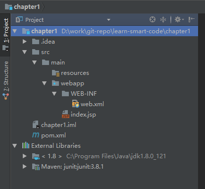
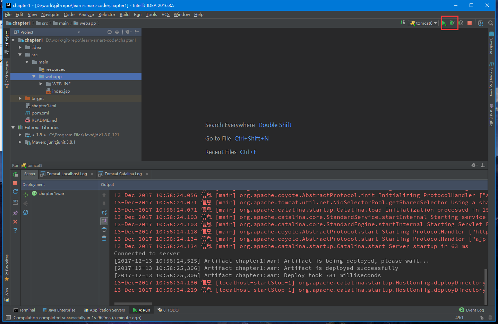

## 使用idea和maven创建java web项目，并通过tomcat运行

1. 新建Maven项目

    1. File -> New -> Project

    2. 操作界面如下图，选好后点击next

        

2. 填写maven坐标

    ```txt
    GroupId     填写包名
    ArtifactId  填写项目名
    Version     填写版本
    ```

    这三个属性表示项目的唯一性，本demo配置如下图

    

3. maven配置

    按需修改，这里全是默认的

    

4. 项目配置

    按需修改名和路径

    

    点击Finish，项目目录结构如下图

    

5. tomcat配置

    1. 打开Edit Configurations，新增Tomcat Server，如下图

    

    2. 选则本地的tomcat，没有则配置

    

    

    选择后如下图

    

    配置Deplyment,点击右边加号或者下面fix添加一个项目(artifacts)，如下图

    ```txt
    war模式：将WEB工程以包的形式上传到服务器
    war exploded模式：将WEB工程以当前文件夹的位置关系上传到服务器
    ```

    

    添加后如下图，名字随便改

    

6. 运行

    运行效果如图

    

    

## 其它

    通过tomcat运行需要专业版idea，下篇讲如何使用maven插件运行web项目，使用社区版idea即可。

## 参考博客

- [使用IntelliJ IDEA 15和Maven创建Java Web项目](http://blog.csdn.net/myarrow/article/details/50824793)

- [Tomcat部署时war和war exploded区别以及平时踩得坑](http://blog.csdn.net/xlgen157387/article/details/56498938)