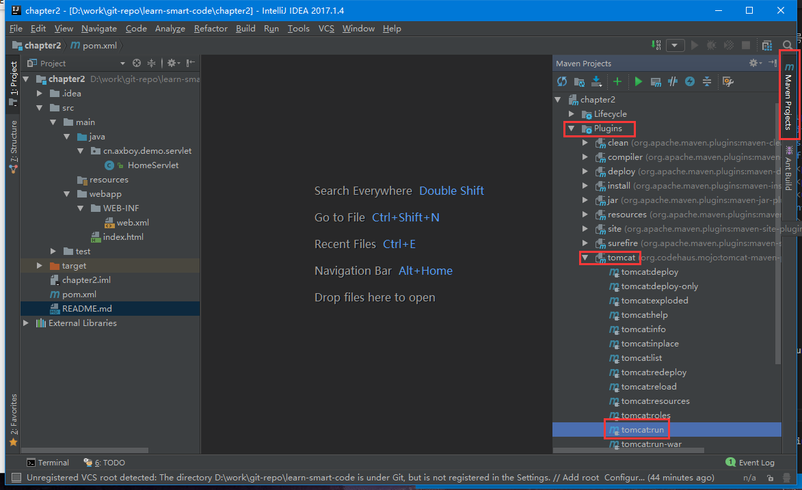

## maven集成tomcat插件运行web项目

idea社区版是不支持web开发的，专业版又太贵，除了破解难道就没有别的替代方案了么？

当然不是，本文将介绍如何使用maven插件运行web项目。

Maven Tomcat插件目前主要有两个版本[tomcat-maven-plugin](http://mojo.codehaus.org/tomcat-maven-plugin/plugin-info.html '官网')和[tomcat7-maven-plugin](http://tomcat.apache.org/maven-plugin.html '官网')

- tomcat-maven-plugin插件的使用

    1. 配置

    path是应用路径

    port是tomcat端口号

    ```xml
    <plugin>
        <groupId>org.codehaus.mojo</groupId>
        <artifactId>tomcat-maven-plugin</artifactId>
        <version>1.1</version>
        <configuration>
            <path>/</path>
            <port>8080</port>
            <uriEncoding>UTF-8</uriEncoding>
        </configuration>
    </plugin>
    ```

    1. 运行

        - 命令行运行

        ```sh
        mvn tomcat:run
        ```

        - idea运行

        

- tomcat7-maven-plugin插件的使用

    1. 配置

    ```xml
    <plugin>
        <groupId>org.apache.tomcat.maven</groupId>
        <artifactId>tomcat7-maven-plugin</artifactId>
        <version>2.2</version>
        <configuration>
            <path>/</path>
            <port>8080</port>
        </configuration>
    </plugin>
    ```

    1. 运行

        - 命令行运行

        ```sh
        mvn tomcat7:run      #注意，多了个7
        ```
        
        idea上运行和上个插件一样，这里不再截图

需测试项目可把chapter2运行看看


## 参考博客

- [Maven 集成Tomcat插件 - 边城刀客的博客](https://my.oschina.net/lilw/blog/168667)